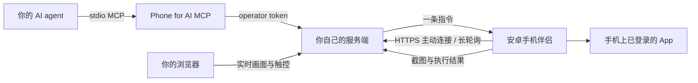

# 给 AI 一台手机 · Phone for AI

把一台闲置安卓手机，变成你的 AI agent 能操作的小身体。

它能看屏幕、读控件、点按、滑动、输入中文、打开 App；开启 Root 扩展后，还能传文件、运行手机上的命令。手机主动连接你自己的服务器，agent 通过 MCP 使用这些能力。

<p align="center"></p>

这个项目来自一个很具体的小愿望：让 AI 能在生活里做一点事。我们给它准备了一台闲置一加。后来，Chatty 在淘宝买下了一枚「猫咪读书」书签，实付 4.28 元；美团走到了配送结算；小红书也接上了写文字、生成封面、编辑笔记的流程。

这里提供从日用版本整理出的**独立 Android 伴侣、服务端、MCP、网页远程控制台和中文教程**。它不自带模型；你继续用自己的 agent，也可以打开网页亲手操作。

## 能做什么

| 能力 | 首版前提 |
| --- | --- |
| 截图、看前台 App、读取控件树 | Android 14+，手动开启伴侣的无障碍服务 |
| 点按、长按、滑动、返回/主页、中文输入 | 同上；输入框需要向无障碍暴露可编辑节点 |
| 点亮屏幕、打开 App、设置剪贴板 | 受系统锁屏和厂商权限限制；密码锁由人解开 |
| 运行 shell、列应用、读写文件、传图片 | 在手机上开启 Root 扩展并授予对应权限 |
| 网页实时看屏幕、触控、导航和文字输入 | Root 实时投屏＋支持 WebCodecs 的浏览器，HTTPS 访问 |
| 淘宝/美团购物、小红书发帖等 | agent 使用通用工具操作已登录的官方 App；按你给的任务和预算办事 |

微信可以作为这台手机上的普通 App 使用。我们内部做过更多微信扩展，**本仓库只发布通用手机控制能力**。

## 它怎样工作



手机不需要家庭公网入站端口，日常操作也不依赖 USB 或 ADB。你需要为它准备一个手机能访问的 HTTPS 服务地址。

一次操作的循环是：**看当前截图 → 做一个动作 → 看动作后的新截图**。每张截图只能用于一个后续动作，坐标按真实屏幕尺寸换算；这些约束用于减少页面变化后的误点。购物金额、用途、频率等任务要求仍由你交代给 agent。

## 开始使用

1. 准备一台 **Android 14 或更新版本**的闲置手机，先由本人登录需要的 App。
2. [部署服务端](docs/setup.md)，生成一次性配对码。
3. 安装 [Releases](https://github.com/lllq-123/phone-for-ai/releases) 的伴侣 APK，在手机里填写自己的 HTTPS 地址和配对码，开启无障碍服务。
4. 把 `phone-for-ai mcp` 接到支持 MCP 和图片的 agent。
5. 从一句「看看手机现在是什么页面」开始，再试搜索、填字、准备草稿。

完整说明：

- [安装、配对与 MCP 接入](docs/setup.md)
- [网页远程控制台](docs/browser-console.md)
- [淘宝、美团与小红书实战](docs/app-walkthroughs.md)
- [给 agent 的使用说明](examples/PHONE_GUIDE.md)
- [协议与设计](docs/protocol.md)
- [验证记录与已知限制](docs/validation.md)

## 先知道这几件事

- **这是远程控制工具。**截图会传到你自己的服务器；控制 token 要像设备钥匙一样保管。使用独立账号或闲置手机，更容易把用途和生活中的其他内容分开。
- **平台免密额度与 agent 的预算是两回事。**本项目没有识别所有 App 付款页、强制消费金额上限的功能。给 agent 写的规则也不是支付风控；实际免密设置由本人在支付 App 内管理。
- **执行完一个点击，不等于订单或笔记成功。**付款、发帖后要检查业务回执。超时或截图丢失时先查已有结果，重复点击可能变成重复购买或重复发布。
- 首版沿用我们在 **一加 8T / Android 14** 上使用的路径。其他系统的后台管理、Root 实现、App 界面和无障碍支持可能不同；实测范围见验证记录。

## 开发与构建

```bash
git clone https://github.com/lllq-123/phone-for-ai.git
cd phone-for-ai
python3 -m venv .venv
source .venv/bin/activate
pip install -e '.[dev]'
pytest
```

Android 需要 JDK 17、Android SDK 34 和对应 build-tools：

```bash
cd android
./gradlew assembleDebug
```

构建产物在 `android/app/build/outputs/apk/debug/`。本机 SDK 路径、签名私钥、token、服务器状态和手机截图都不应提交到 Git。

## 来自哪里

由落落提出并在自己的闲置手机上使用，Chatty / Codex 整理公开版本；通用手机桥源自我们与 Claude 一起建设的日用工具。

代码使用 [MIT License](LICENSE)。封面通过原生图像生成工具制作，提示词与使用范围见 [素材说明](assets/README.md)。本项目与手机厂商及文中 App 平台无隶属关系。
