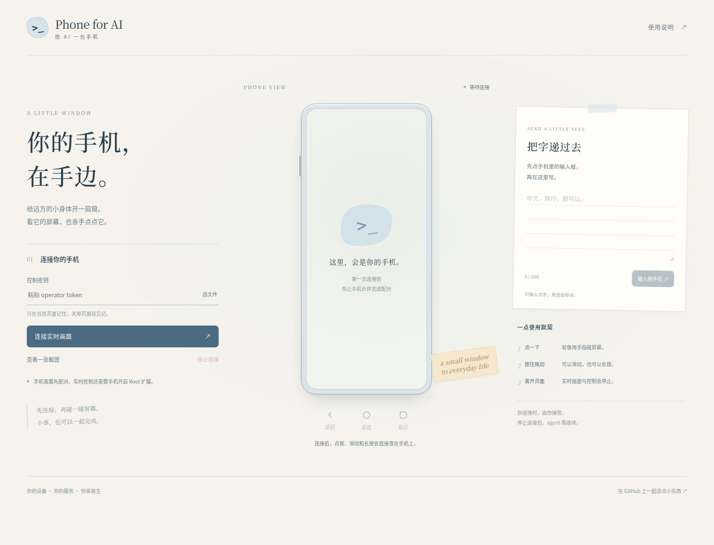

# 人也能用的网页控制台

部署完成后，在自己的 HTTPS 服务根地址打开网页，例如 `https://phone.example.com/`。

1. 选择本机的 `operator.token` 文件，或粘贴密钥。
2. 手机已配对、无障碍与 Root 扩展开启后，点“连接实时画面”。
3. 第一帧画面出现后，直接在手机画面上点按、拖动、长按；底部有返回、桌面和最近任务。
4. 输入文字时，先点手机中的目标输入框，再在侧边写字并点“输入到手机”。查看手机回显后，再由你点发送。
5. 结束时点“停止连接”。切到其他标签页、离开或关闭页面也会停止传屏和控制；回来后可以重新连接。

实时模式由 scrcpy 4.1 提供手机端 H.264 视频与触控，服务端只做鉴权转发，浏览器通过 WebCodecs 解码。它需要手机 Root，以及支持 H.264 WebCodecs 的浏览器和安全上下文（HTTPS，或同机 localhost）。首版没有录屏保存功能。

还没开启 Root 时，可以先点“查看一张截图”。单张截图依赖无障碍截图能力，不提供连续控制；不会偷偷切成轮询视频。

## 与 agent 怎么配合

实时网页连接由人独占控制，MCP 里会改变手机状态的操作暂时拒绝。结束网页连接后，再叫 agent 重新截图接着做。同一服务一次只连接一个观看者，避免两个人、两个 agent 同时拖动手机。

浏览器的密钥只保存在当前页面内存中，不写入 URL、localStorage 或永久 Cookie；关闭页面后需要重新提供。服务器静态页面不含密钥，真正的状态、图片和控制接口都要求鉴权。

网页给出“文字已递给手机”只表示控制消息已发送，目标输入框是否接受、是否需要粘贴，以手机实际画面为准。

## 常见问题

- **点连接却没有画面**：看手机伴侣状态、Root 授权和网络；另外检查反向代理是否支持 WebSocket Upgrade。
- **浏览器不支持解码**：使用支持 WebCodecs/H.264 的新版本浏览器，先用单张截图确认服务链路。
- **页面回来后是暂停**：这是停止控制后的状态，手动重新连接即可。
- **MCP 提示 phone_stream_in_use**：停止网页连接，等手机结束该次直播再继续。
- **画面尺寸/方向变化**：控制台会暂停旧触控，等新画面解码完成再接受操作；不要缓存旋转前的坐标。

源码在 `web/`；协议见 [protocol.md](protocol.md)，验证情况见 [validation.md](validation.md)。
